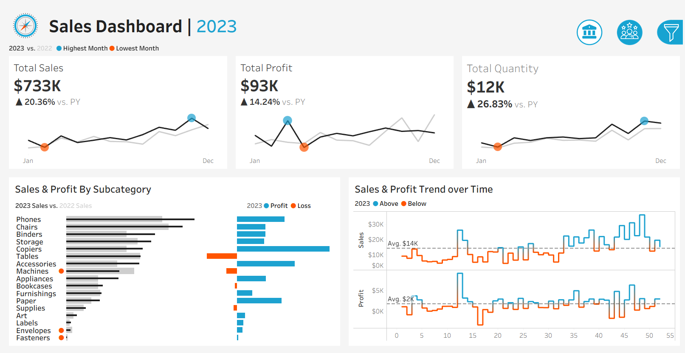
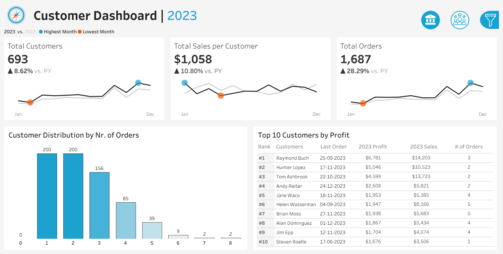

# 📊 Sales & Customer Performance Dashboard

This project features **two interactive Tableau dashboards** designed to provide key stakeholders, including sales managers and executives, with comprehensive insights into **sales performance** and **customer behavior**. These dashboards facilitate year-over-year analysis, trend identification, and a deeper understanding of customer segments to drive strategic decision-making.

---

## 🧭 Sales Dashboard

The **Sales Dashboard** provides a clear overview of key metrics and trends, enabling users to:

- Analyze year-over-year sales performance
- Identify significant sales patterns

### 🔑 Key Features:

#### 📌 KPI Overview
- Displays **total sales**, **total profits**, and **total quantity** for both the current and previous year.

#### 📈 Sales Trends
- Visualizes **monthly KPI data** (sales, profit, quantity) for current and previous year.
- Highlights **peak and lean months**.

#### 📊 Product Subcategory Comparison
- Compares **subcategory performance** across years.
- Combines sales with profit for **profitability analysis**.

#### 📆 Weekly Trends for Sales & Profit
- Weekly sales and profit data for the current year.
- Highlights **above/below average** performance weeks.

---

## 🧑‍💼 Customer Dashboard

The **Customer Dashboard** provides insights for marketing and management teams into **customer engagement**, **behavior**, and **segmentation**.

### 🔑 Key Features:

#### 📌 KPI Overview
- Summarizes **total number of customers**, **sales per customer**, and **total orders** for both years.

#### 📈 Customer Trends
- Visualizes **monthly customer activity**.
- Identifies **peak/low engagement months**.

#### 📦 Customer Distribution by Orders
- Shows **order frequency distribution**, revealing loyalty and purchasing behavior.

#### 🏆 Top 10 Customers by Profit
- Lists customers contributing the highest profits.
- Includes **rank**, **total orders**, **sales**, **profit**, and **last order date**.

---

## 🧩 Design & Interactivity

- **Year Selector**: Filter historical data dynamically.
- **Navigation**: Seamless switch between dashboards.
- **Interactive Charts**: Click to filter.
- **Advanced Filters**: Slice by product (category, subcategory) and location (region, state, city).

---

## 🧠 SQL-Based Business Insights

This project also includes a **collection of advanced SQL queries** that derive deep insights from the same retail dataset, using techniques such as **window functions**, **CTEs**, **ranking**, and **rolling aggregates**.

📄 **Query File**: [`sales_cust_sql_analysis.sql`](./sales_cust_sql_analysis.sql)

### 📌 Key SQL Insights:

| Insight | Description |
|--------|-------------|
| 📅 **Monthly Sales & Profit** | Chronological trend with formatted month labels |
| 🏆 **Top 10 Customers by Profit** | Ranked using window functions (RANK) |
| 🗺️ **Best Sub-Category by Region** | Regional leaders via partitioned ranking |
| 📈 **YoY Sales Growth** | Calculates year-over-year percentage growth |
| 🎖️ **Customer Loyalty Tiering** | Platinum / Gold / Silver segmentation using CASE |
| 📊 **3-Month Rolling Avg** | Moving average to smooth volatility |
| ⚙️ **Profit Per Unit** | Efficiency by sub-category (profit ÷ quantity) |

These queries were written in **MySQL** and can be used independently or to power dashboards in Tableau, Power BI, or custom web apps.

---

### 💡 How to Run

1. Open `sales_cust_sql_analysis.sql` in your SQL editor (e.g., **MySQL Workbench**).
2. Execute query blocks as needed.
3. Optionally create SQL views from the queries for integration with BI tools.

---

## 🚀 How to Use This Project

1. **Download**: Clone this repo or download the `.twb` file(s).
2. **Open**: Use **Tableau Public** (version 2025.2 or later recommended).
3. **Data Source**:  
   > _Ensure you connect Tableau to the file(s) inside the `datasets/` folder._  
   > _These contain the necessary data for the dashboards to function properly._
4. **Explore**:  
   - Use **dynamic year selection**  
   - Switch between dashboards  
   - Apply filters and interact with visual elements

---

## 🖼️ Screenshots

  

---

## 📂 Data Source

> This project uses data files located in the `datasets/` folder as the source for all Tableau visualizations.
---

## 👤 Author

**Kartik Sharma**

[LinkedIn Profile](https://www.linkedin.com/in/sh-kartik/)  
[Tableau Public Profile](https://public.tableau.com/app/profile/kartik.sharma1671/vizzes)  
[🔗 View Dashboard on Tableau Public](https://public.tableau.com/app/profile/kartik.sharma1671/viz/SalesAndCustomerDashboard_17521591284010/SalesDashboard)

---

📌 *Feel free to fork and customize this dashboard as per your analysis needs!*

# 📚 Credits

This Tableau dashboard project is heavily inspired by the tutorials shared on the [Data with Baraa](https://www.youtube.com/channel/UC8_RSKwbU1OmZWNEoLV1tQg) YouTube channel.

Their content was instrumental in shaping the structure, design, and logic of the dashboards.

🙏 Big thanks to them for making high-quality learning resources available to the community!
